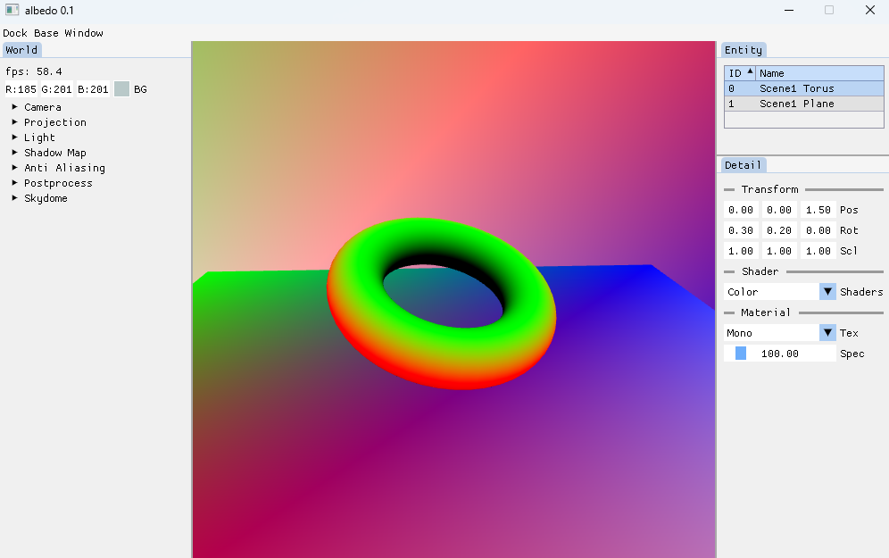

# min-renderer-d3d12

A minimum-scale rendering application with d3d12.  
This project can be built on vscode.  

	

## Rendering Features
Forward Rendering  
MSAA  
Shadow Mapping  

## Requirements to compile project
Clang  
CMake version >=3.5  
Ninja  
MSVC x86-64 build  
Windows SDK

## Acknowledgements
[GLFW](https://www.glfw.org/)  
[glm](http://glm.g-truc.net/)  
[Dear ImGui](https://github.com/ocornut/imgui)  

[Poly Haven](https://polyhaven.com/)